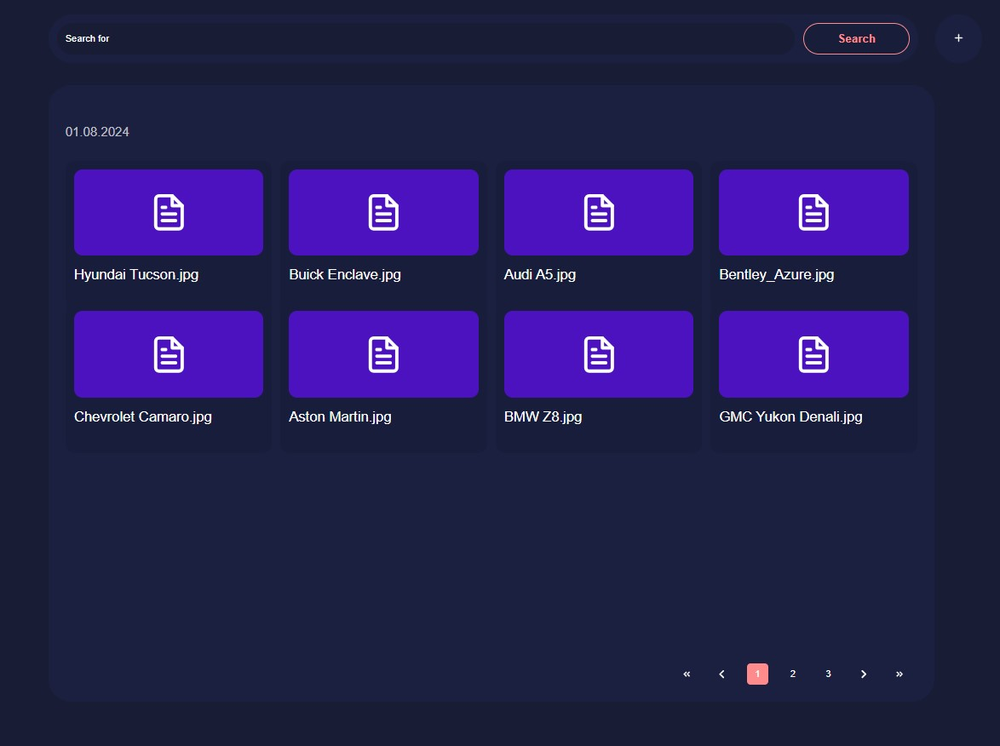

<h1 align="center">Files Storage</h1>

Files Storage is a web application for organizing and uploading files.

## Features

- **Upload files:** Users can upload files and view information about existing files.
- **Size:** The upload functionality supports files ranging from 1KB to 7GB.
- **Reload error:** Users cannot upload duplicate files.
- **Search :** User can search the file by name.
- **Download counter:** Each file includes information about the number of downloads.

## Technologies Used

- **Frontend:** TypeScript, React.js, Redux, Formik, Yup
- **Backend:** Node.js, Express.js, MongoDB, Supabase storage

